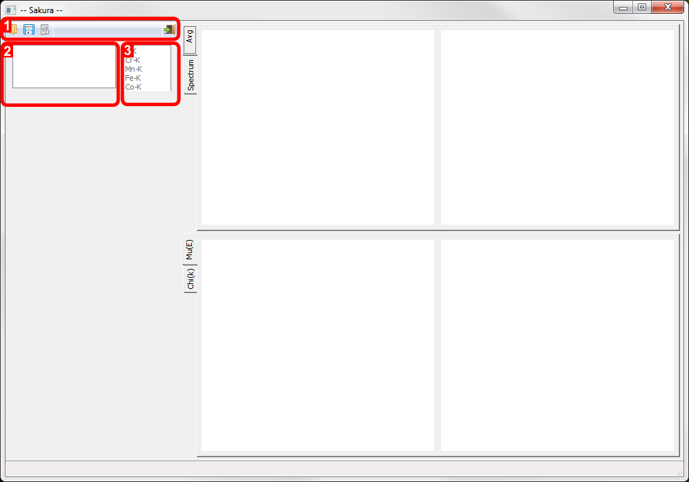
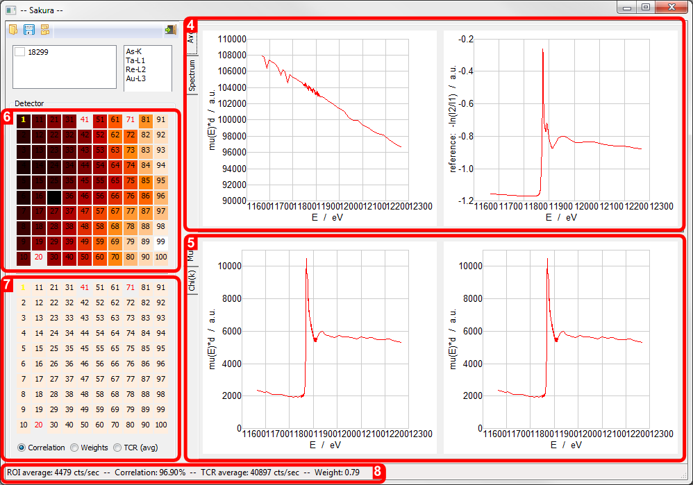
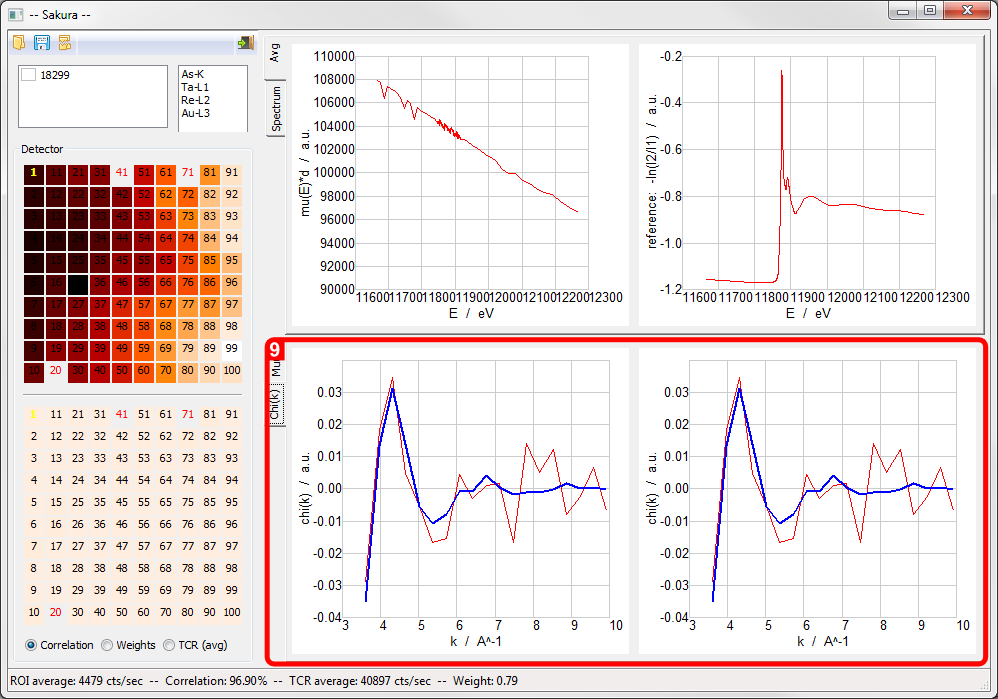
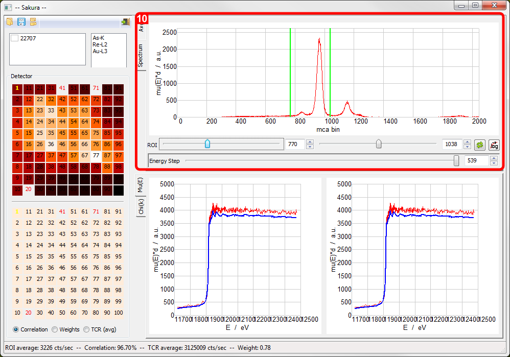

.. |degree| unicode:: U+00B0   .. degree trimming surrounding whitespace
    :ltrim:

.. _usage_root:

Usage
*****

This page describes the usage of Sakura.

On startup
----------

When started, Sakura presents the following empty interface with red overlays identifying the following parts of the user interface:

   Sakura (Windows version) on startup identifying parts of the user interface: 1. Toolbar, 2. File list, 3. Edge list.

1. Toolbar.
    From left-to-right, the toolbar buttons allow you to 1a) Open a scan dataset, 1b) Export reduced data as ASCII, 1c) Unload all loaded datasets, 1d) Exit the program.

    1a) Open a scan dataset.

    Sakura allows processing of step-mode and mapping-mode datasets. In the case of step-mode data, all data is stored in an individual .mda file. In the case of mapping-mode data, a .mda file contains experiment metadata process variables (PVs), whereas the raw spectral data is stored in accompanying netCDF files. In both cases, the data is loaded by opening the appropriate .mda file in the open file dialog.

    1b) Export reduced data as ASCII.

    When clicked, any processed data in any checked datasets in the File list box are written to ASCII files with the same name as the .mda file, but with a .asc filename extension.

    1c) Unload all loaded datasets.

    All data is unloaded. Equivalent to exiting and restarting Sakura.

    1d) Exit the program.
    
    Quits Sakura. The same as trying to close the main window.

2. File list
    Currently loaded files appear here alongside a checkbox that is used to choose datasets for export.

    .. note::
    Step-mode and mapping-mode datasets cannot be simulataneously loaded.

3. Edge list
    Candidate edges are listed here.
    Selecting one ???

On file load
------------

Once a file is loaded, the following display areas become active:

   
   Sakura screen areas activated by file load: 4. Average Absorption Edge Spectrum and ??? plots, 5. Absorption Edge Spectrum [mu(E)*d mode], 6. 100-element detector selection widget, 7. 100-element detector selection widget/statistics map, 8. Numerical statistics report.

4. Average Absorption Edge Spectrum and ??? plots
    Blah ???

5. Absorption Edge Spectrum [mu(E)*d mode]
    ???

6. 100-element detector selection widget
7. 100-element detector selection widget/statistics map
8. Numerical statistics report

Switching Absorption Edge Spectrum display mode
-----------------------------------------------

9. Absorption Edge Spectrum [Chi(k) mode]

   
   The reciprocal Absorption Edge Spectrum display is accessed via the Chi(k) tab.

Mapping mode dataset spectrum view
----------------------------------

10. Multichannel analyser plot with ROI selection

   For netCDF-based mapping-mode datasets, clicking the Spectrum tab in the upper display accesses the MCA spectrum display.

* The Spectrum display allows the ROI limits to be set.
* To lock the Spectrum display to show a particular detector element, left-click the mouse on the detector element of interest. The element number changes to Bold Yellow. Repeat this action to unlock the element.
* After setting the ROI limits using the ROI setters, clicking the Reprocess button will recompute the Absorption edge displays.

TBC